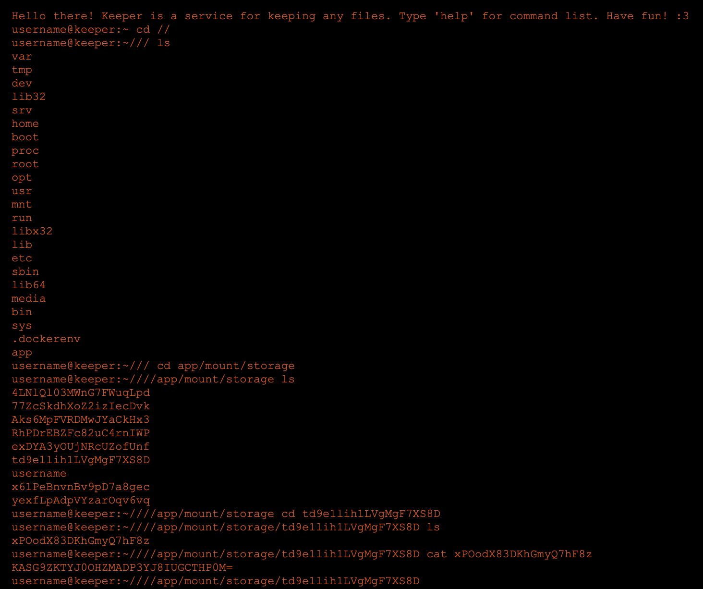

# keeper

#### Vulnerability
There is a path traversal. The main file downloading handler `/files/*` has no path bounds check.
With login like that: `abcd/../..` (it is possible due to login validation absence on the backend).
It allows list the storage directory with user files (which contain flags).
Moreover, it is possible to pass `//..` to file path. It jumps to the file system root.
So, you can list all user files.   

#### Attack from browser

#### Defense
Fix login checking on the backend and forbid `//` in the path in file downloading handler.
