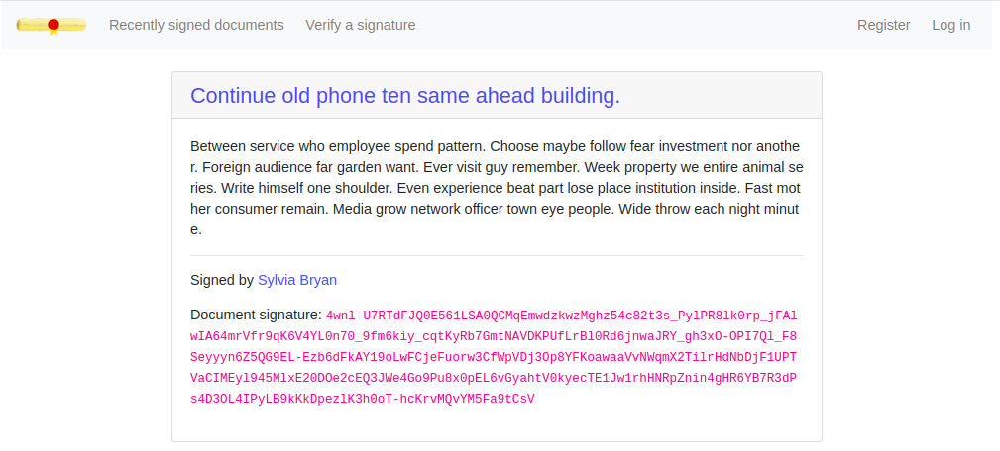
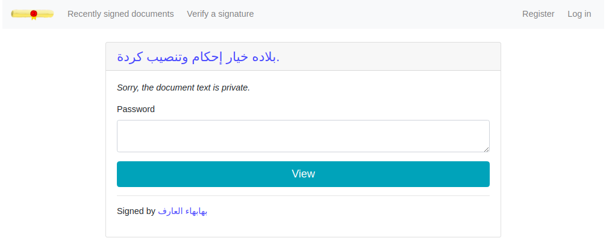
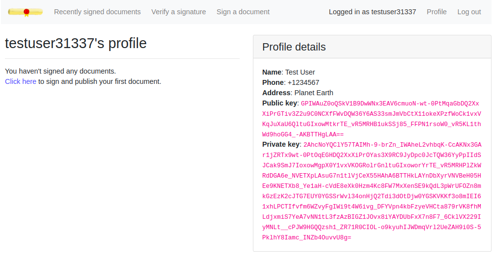
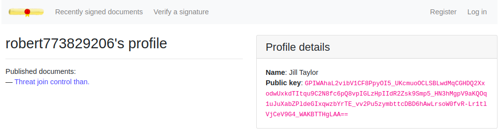
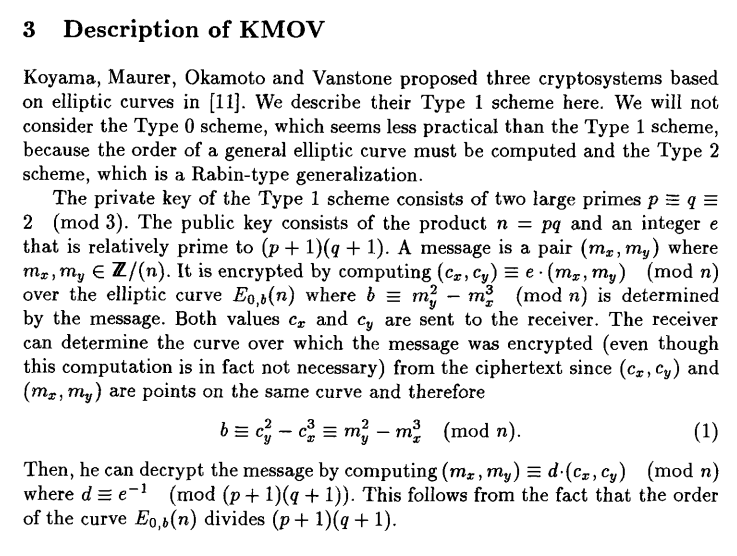

# RuCTFE 2020 | Notary

## Service description

**Notary** is a web service designed as a notary center:


All users have their own public and private keys, which are required for signing documents and verifying signatures. Each document has a visibility property and may be protected with a password. But the document owner always can view the document content:





Also, some sensitive information about user (ex. Phone number and Address) is private and can not be visible for others:





Our goal is be able to:

- get the private document password to view its content
- get the user password to view its sensitive data

The web service itself is written in Python and using the external custom cryptographic library for digital signatures.

- Web service source code: [link](../../services/notary/notaryserver)
- `libnotary.so` source code: [link](../../services/notary/libnotary)

The source code of `libnotary.so` was not provided.

## libnotary description

All vulnerabilities was located in `libnotary.so`, so I will describe it a bit. There was implemented KMOV algorithm: an RSA-like algorithm based on elliptic curves. Below is a screenshot from the paper [On the Security of the KMOV Public Key Cryptosystem](https://www.iacr.org/cryptodb/data/paper.php?pubkey=1033) by Daniel Bleichenbacher:



The security of KMOV, as of RSA, based on integer factorization. If we found such `p` and `q` that `N == p * q`, we will be able to forge the signature.

## Vulnerability 1: XOR

Look at the `__sign_data_to_point` function located in file [sign.c](../../services/notary/libnotary/src/sign.c). There is a code that performs a transformation from the binary data to a elliptic curve point:

```c
void __sign_data_to_point(point_ptr point, mpz_srcptr N, size_t data_size, const uint8_t *data) {
    mpz_t x, y;
    size_t coord_length, value_length;
    uint8_t *value;

    coord_length = (mpz_sizeinbase(N, 2) + 7) / 8;
    value_length = 2 * coord_length * sizeof(uint8_t);

    value = malloc(value_length);
    memset(value, 0xFF, value_length);

    for (size_t i = 0, j = 0; i < data_size; i++, j++) {
        if (j == value_length) {
            j = 0;
        }

        value[j] ^= data[i];
    }

    mpz_inits(x, y, NULL);

    mpz_import(x, coord_length, LSB_FIRST, sizeof(uint8_t), NATIVE_ENDIANNESS, 0, value);
    mpz_import(y, coord_length, LSB_FIRST, sizeof(uint8_t), NATIVE_ENDIANNESS, 0, value + coord_length);

    // x = x % N
    mpz_mod(x, x, N);

    // y = y % N
    mpz_mod(y, y, N);

    mpz_set(point->x, x);
    mpz_set(point->y, y);

    mpz_clears(x, y, NULL);

    free(value);
}
```

What does it mean? 

Let's imagine that we have the modulus `N` size of `length` bytes and the binary array `data`. We need to transform the `data` array to a point with coordinates `x` and `y` (each size of `length` bytes). The code just XORs each data block of length `2 * length` and then splits it on two subarrays with length `length`, which will be be transformed into integers.

```python
result = data[0:2*length] ^ data[2*length:4*length] ^ ...  # len(result) == 2 * length
x, y = result[:length], result[length:]
```

It's obviously that if we can control the `data` array, we can obtain arbitrary elliptic curve point, just doing some XOR operations. But how it can be used?

According to [models.py](../../services/notary/notaryserver/models.py), the password of each document is just a signature of the special object, where `document_id` is an identificator of the document:

```python
{
    'title': 'document_id',
    'text': document_id
}
```

Since this is an object, we can insert additional field (ex. called `garbage`) and store there arbitrary bytes, because it will be ignored. So, now we can construct an elliptic curve point from the `document_id`. How we can sign it using only public key?

Let's take arbitrary point `Q = Point(x, y)`, it will be our _forged signature_ and create a curve `Curve = Curve(0, b, N)`, where `N` is a public key modulus, and `b` is a variable from KMOV paper (described above). Then calculate another point `P = Q * e`, where `e` is a public key exponent. Now `P` is our _plaintext_, since `Q = P * d` is the signature.

Remember that we can create arbitrary point for known `document_id` using `garbage` field? So we can create an object which will be mapped to point `P`:

```python
{
    'title': 'document_id',
    'text': document_id,
    'garbage': '..............'
}
```

And we know `P`'s signature, it's `Q`! Now just pack it correctly, send to the server and read the private document text.

Example sploit: [1_xor.py](1_xor.py)

To patch the vulnerability just prohibit objects with additional ignored fields.

Example patch: [1_xor_patch.diff](1_xor_patch.diff)

## Vulnerability 2: Factorization

It would be better if we could factorize the public key modulus `N = p * q`. If we could do it, we could recover the user's private key and create the password.

Let's look at the `__private_generate_prime` function located in file [private.c](../../services/notary/libnotary/src/private.c). It uses GMP MT19937 random generator to obtain random numbers, but here is a typo:

```c
void __private_generate_prime(mpz_ptr prime, size_t bits, FILE *random) {
    const int32_t checks = 10;

    mpz_t result, remainder;
    uint64_t seed;
    gmp_randstate_t state;

    fread(&seed, sizeof(uint64_t), 1, random);

    gmp_randinit_mt(state);
    gmp_randseed_ui(state, seed);

    mpz_inits(result, remainder, NULL);

    do {
        mpz_rrandomb(result, state, bits);
        mpz_mod_ui(remainder, result, 3);
    } while (mpz_probab_prime_p(result, checks) == 0 || mpz_cmp_ui(remainder, 2) != 0);

    mpz_set(prime, result);

    mpz_clears(result, remainder, NULL);
    gmp_randclear(state);
}
```

The vulnerable function is `mpz_rrandomb`. Tt still generates random numbers, but these numbers have a very low entropy. The binary representation of numbers contains a long strings of ones and zeroes. For example, here is a 1024-bit number generated using `mpz_rrandomb`:

```python
0b1111111111111111111111111000000000000000000000000000000000000000000000000000000000000000000111111111111111111111111111111111111111111111111111111111111111111111111111111111111111111111111111111111111111111110000000000000000000000000000000000000000000000000000000000000000000000000000000000000000000000000000000000000000000000000000000000000000000000000000000000000000000000000000000000000000000000000000000011111111111111111111111111111111111111111111111111111111111111111111111110000000000000000000000000000000000000000000000000000000000000000000000000000000000000000000000000000000000000000000000000001111111111111111111100000000000000000000000000000000000000000000000000000000000000000000000000000000000000000000000000000000000000000000000000000000000000000000000000000000000000000000000000000000000000000000000000000000000000000000000000000000000000000000000000000000000001111111111111111111100000000000000000000000000000000000000000000000000000000000000000000000000000000000000000000000000000000000000000000000011111111
```

Since we know this, we can effectively factorize `N = p * q`, using [Helsel's lifting](https://en.wikipedia.org/wiki/Hensel%27s_lemma) method. 

Let's state that `pi`, `qi` and `Ni` are `i` least significant bits of `p`, `q` and `N` respectively. We would iterate over `i` and collect all possible solutions on each step.

The first `(p1, q1)` pair is `(1, 1)`, because `1 * 1 == 1 (mod 2^1)` (and `N` is always odd). 

Then, incrementing `i`, we would get `4` possible pairs:

```python
[
    (01, 01),
    (01, 11),
    (11, 01),
    (11, 11)
]
```

We need to select only such pairs that `p2 * q2 == N2` (`p * q == N (mod 2^2)`). When we select these pairs, we could increment `i` again and move to the next step.

In general case it is an exponential solution, since on each step it multiplies the number of possible solutions. But we know, that the primes entropy is low, and we can apply some heuristic. 

Let's define a function `H(n)`, it equals to the count of switches `0->1` and `1->0` in the binary representation of `n`. For example, if `n == 1111100000011111000`, `H(n) == 3`. On each step we need to select only `K` possible solutions `(p, q)` with lowest values of `H(p) + H(q)`. Since we know that `H(n)` is low in our case, it remains only the most likely solutions.

One can imagine this algorithm as a [Breadth-first search](https://en.wikipedia.org/wiki/Breadth-first_search) on a tree with nodes `(pi, qi)` and root `(1, 1)`. On each step it adds 4 subnodes to each node and removes subgraphs with _too high_ entropy.

When factorization `N = p * q` is known, we just need to generate user's password and login.

Example sploit: [2_factorize.py](2_factorize.py)

To patch this vulnerability just replace `mpz_rrandomb` with `mpz_urandomb` which is more secure.

Example patch: [2_factorize_patch.sh](2_factorize_patch.sh)
